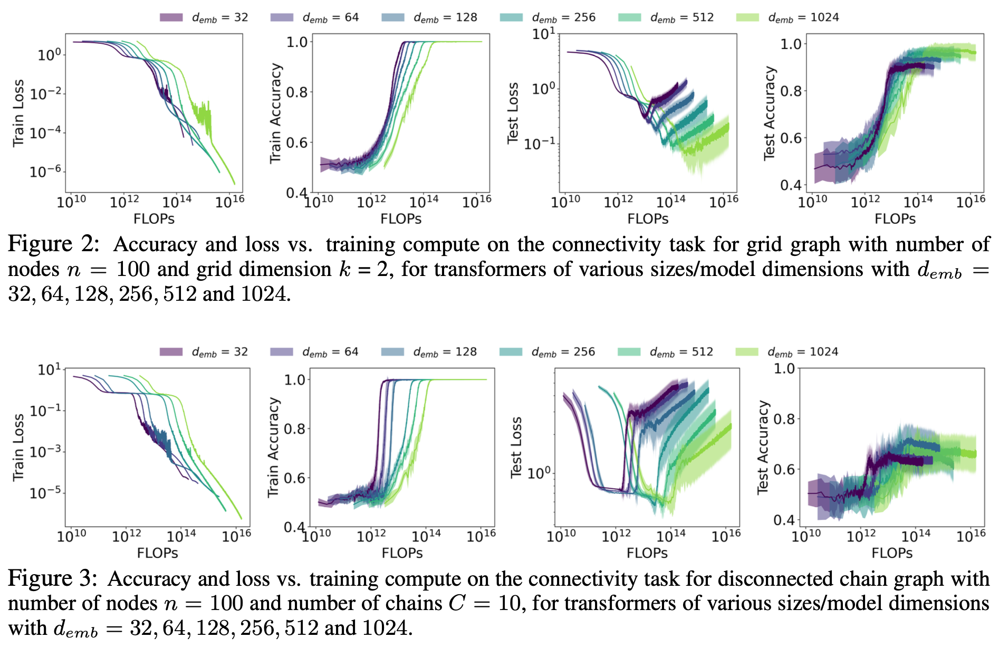
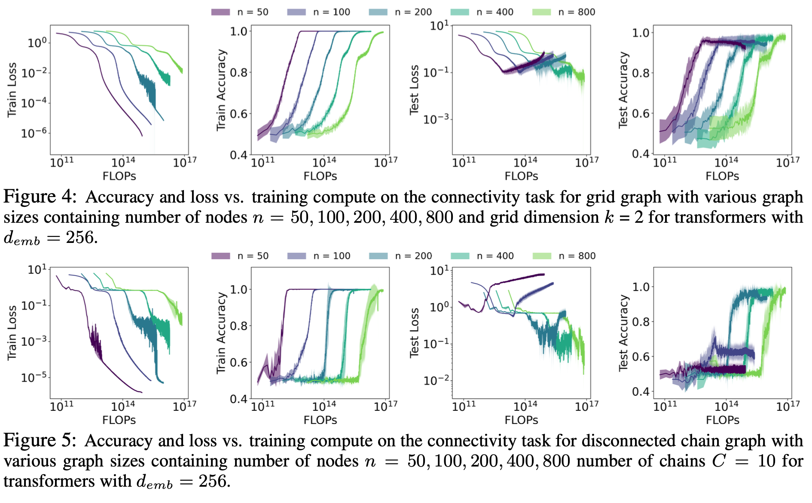
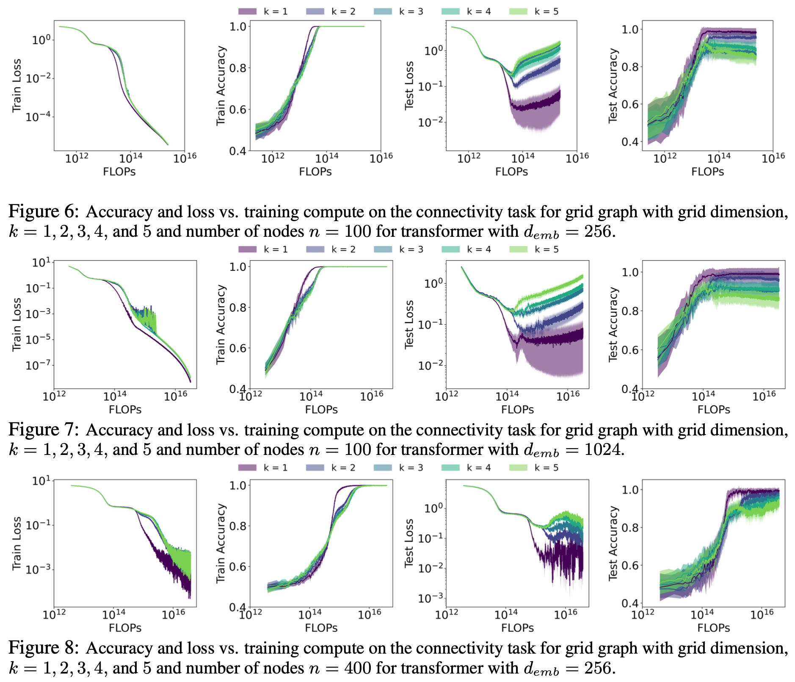
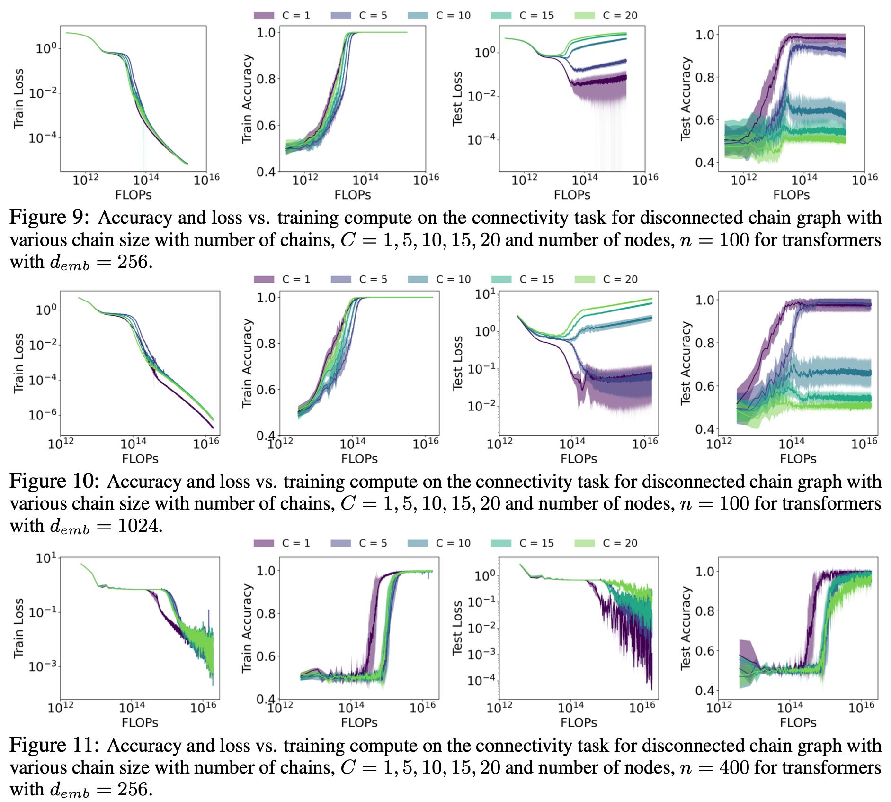

<h1 align="center">Transformers Can Learn Connectivity in Some Graphs but Not Others</h1>

This repository contains the official implementation of the paper 
"Transformers Can Learn Connectivity in Some Graphs but Not Others"

## Abstract
<p align="justify">
Highly competent reasoning capability is essential to ensure the factual correctness of the responses of transformer-based Large Language Models (LLMs), and robust reasoning about transitive relations is instrumental in many settings, such as causal inference. Therefore, it is essential to investigate the capability of transformers in the task of inferring transitive relations (e.g., knowing A causes B and B causes C, we can infer that A causes C). The task of inferring transitive relations is <i>equivalent</i> to the task of connectivity in directed graphs (e.g., knowing there is a path from A to B, and there is a path from B to C, we can infer that there is a path from A to C). Past research focused on whether transformers can learn to infer transitivity from in-context examples provided in the input prompt. However, transformers' capability to infer transitive relations from training examples and how scaling affects this ability is unexplored. In this study, we endeavor to answer this question by generating directed graphs to train transformer models of varying sizes and evaluate their ability to infer transitive relations for various graph sizes. Our findings suggest that transformers are capable of learning connectivity on ``grid-like'' directed graphs where each node can be embedded in a low-dimensional subspace, and connectivity is easily inferable from the embeddings of the nodes. We find that the dimensionality of the underlying grid graph is a strong predictor of transformers' ability to learn the connectivity task, where higher-dimensional grid graphs pose a greater challenge than low-dimensional grid graphs. In addition, we observe that increasing the model scale leads to increasingly better generalization to infer connectivity over grid graphs. However, if the graph is not a grid graph and contains many disconnected components, transformers struggle to learn the connectivity task, especially when the number of components is large. We also find that transformers benefit more from increasing the graph size than increasing the model size. The code of our experiments is publicly available at <a href="https://github.com/anonymoususer437/transformers_graph_connectivity">github.com/anonymoususer437/transformers_graph_connectivity</a>
</p>


## Main Parameters

```
--d_emb                        Token Embedding dimension (default: 256)
--d_pos                        Positional encoding dimension (default: 2)
--d_hid                        Hidden dimension in transformer input (default: 32)
--heads                        Number of attention head in transformer (default: 2)
--num_layers                   Number of layers in transformer (default: 4)
--dropout                      Dropout for transformer layer (default: 0)
--max_seq_length               Length of maximum sequence (default: 2)
--batch_size                   Number of node pairs in each batch (default: 1024)
--num_epochs                   Number of epochs during training (default: 10000)
--learning_rate                Learning rate during model training (default: 0.001)
--weight_decay                 Hyperparameter for L2-regularization (default: 0)
--show_loss                    Show train and test loss plot during training (default: False)

--total_nodes                  Total nodes in the disconnected chain graph (default: 100)
--number_of_chains             Number of chains in the disconnected chain graph (default: 10)
--grid_dim                     Number of dimension for grid graphs (default : 2)
--M_test                       Parameter to generate test examples (default: 40)
```

## Environment Setup

Create virtual environment

```
python3.11 -m venv py311
source ~/py311/bin/activate
```

Update setuptools
```
pip3 install --upgrade pip setuptools
```

Install Pytorch
```
pip3 install torch torchvision torchaudio --index-url https://download.pytorch.org/whl/cu121
```

Install Necessary Python Packages
```
pip3 install scikit-learn

pip3 install tqdm

pip3 install matplotlib

pip3 install pandas

pip3 install seaborn
```
## Basic Usage

Run the python file to train the model with appropriate parameter changes if necessary.

*Grid Graphs*

```
cd grid_graph_experiments
python3 model_scaling_grid_graph_transformer.py
python3 data_scaling_grid_graph_transformer.py
python3 multi_grid_graph_transformer.py
```

*Chain Graphs*

```
cd chain_graph_experiments
python3 model_scaling_chain_graph_transformer.py
python3 data_scaling_chain_graph_transformer.py
python3 multi_chain_transformer.py
```


## Experimental Results

**Model Scaling experiments for grid graphs and chain graphs**



**Data Scaling experiments for grid graphs and chain graphs**



**Scaling experiments for multiple grids in grid graphs**



**Scaling experiments for multiple chains in disconnected chain graphs**

